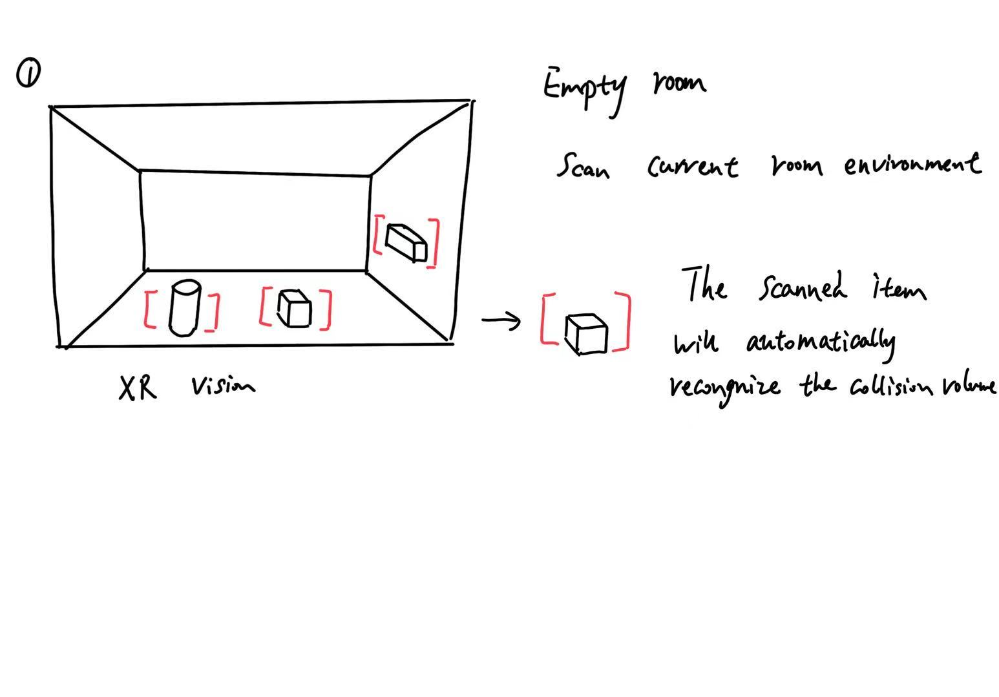
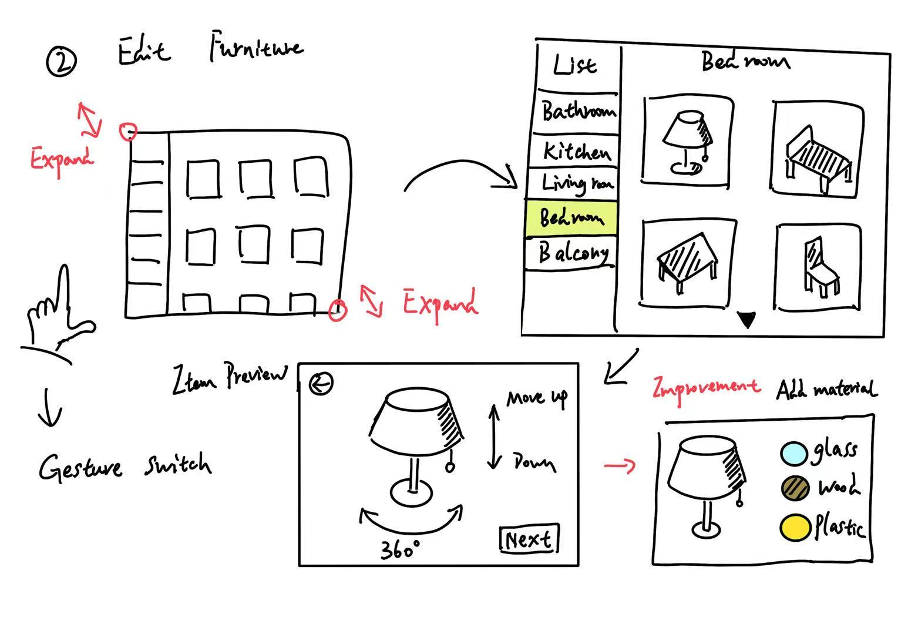
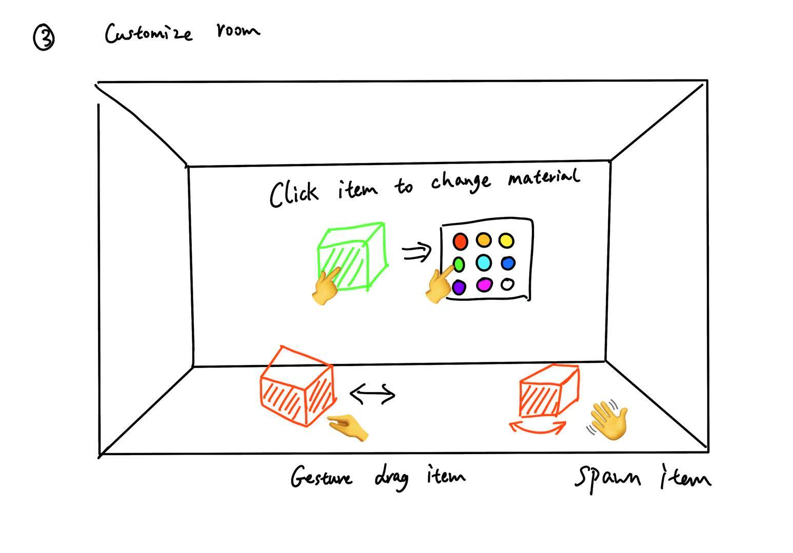
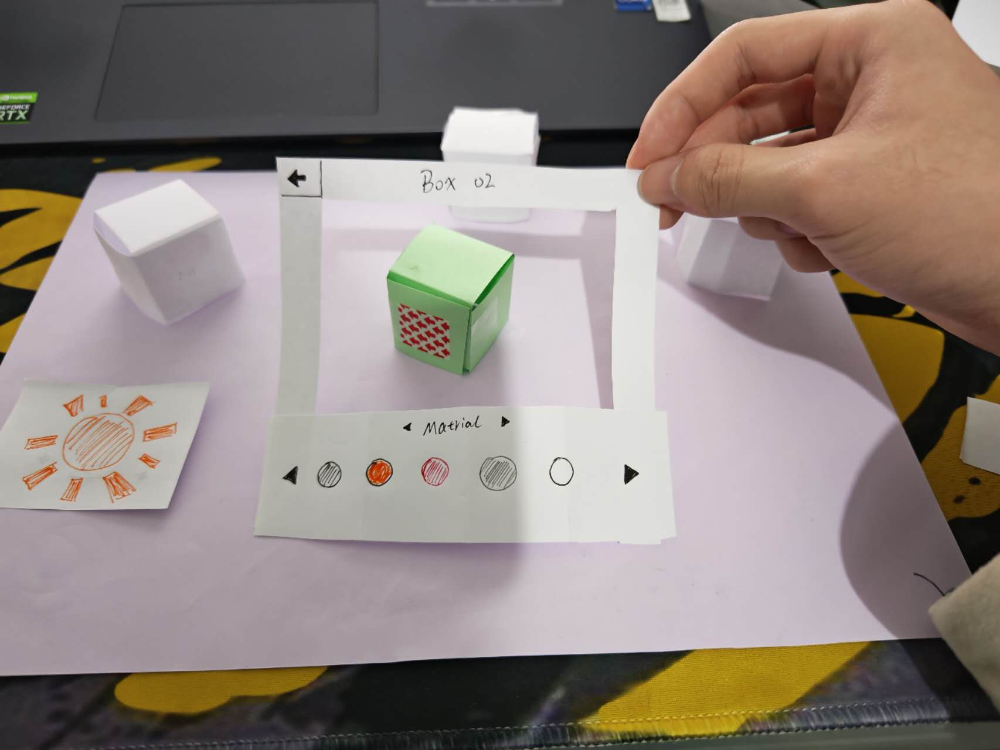
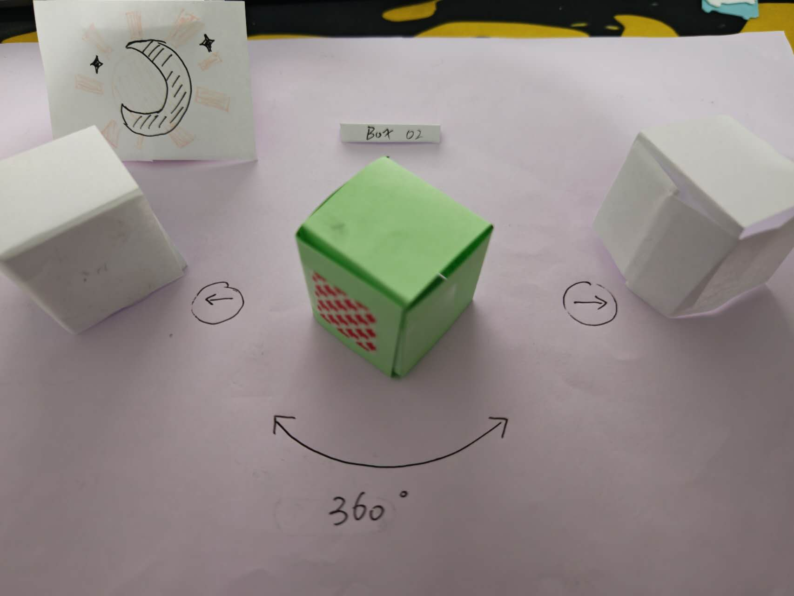

# Concept Documentation

## 1. Project Overview
I extended IKEA Place’s existing AR furniture placement into an immersive XR version, adding real-time material switching, collision feedback, and environment switching to enhance immersion and efficiency in furniture layout and interior design.

## 2. Initial Design Concepts
- Realistic scale furniture placement
- Natural gesture-based interaction
- Real-time material and color editing
- Environment switching for ambiance preview

## Early Sketches & Prototypes

## 3. Research Findings

### 3.1 Existing Similar Software
1. **IKEA Place (AR)**
   - Strengths: Real-scale AR placement, easy-to-use interface
   - Weaknesses: Limited to single-user AR, no immersive VR mode, lacks multi-user collaboration

2. **Planner 5D**
   - Strengths: 2D/3D interior design, library of furniture models
   - Weaknesses: AR is not core feature, lacks real-scale immersive interaction

3. **Homestyler**
   - Strengths: Professional design tools, material customization
   - Weaknesses: Desktop-oriented, lacks natural gesture or XR immersion

**Conclusion:**  
Current solutions focus on AR preview and 2D/3D design tools, but lack full XR immersion, natural gesture interaction, and multi-user collaboration.

## 4. Technical Feasibility Analysis

### 4.1 Tools & Frameworks
- Unity 2022
- Meta Quest 3 with gesture detection
- Unity physics engine for collision detection
- Shader and material swapping scripts for real-time rendering

### 4.2 Feasibility Points
- Gesture tracking for grab/expand/rotate is supported on Quest 3/Pro hardware
- Real-time material switching is achievable with Unity’s MaterialPropertyBlock
- Environment switching (day/night) can be implemented with dynamic lighting & skybox changes

## 5. Planning & Timeline
| Week | Tasks |
|------|-------|
| Week 1 | Research existing apps, define concept and XR features |
| Week 2 | Create low-fidelity prototypes (cardboard models, sketches) |
| Week 3 | Conduct initial usability testing with prototypes |
| Week 4-10 | Start Unity XR implementation: environment setup & gesture interaction |
| Week 5-11 | Add collision feedback, material switching |
| Week 6-12 | Implement day/night switching, basic multi-user sync |
| Week 13 | Final user testing & iteration |

## 6. User Research Plan
Search for 5-10 users to experience XR projects and provide suggestions

**Focus:**
- Ease of understanding gesture controls
- Effectiveness of real-time material switching
- Immersion and presence in different environments

**Data to Collect:**
- Task completion time
- Error rates (e.g., misplacement, collision issues)
- User subjective ratings (immersion, usability, satisfaction)

## 7. References
- IKEA Place. (2018, July 15). IKEA%20place%20%20%20AR%20App. [Bilibili.com](https://www.bilibili.com/video/BV1Qs411J7J5/?spm_id_from=333.1007.top_right_bar_window_history.content.click)
- Planner 5D. (n.d.). [3D Home Design Software | House Design Online for Free - Planner 5D](https://planner5d.com)
- Yi Yang. (2020, February 4). HCI Paper Prototype by Yi Yang. [YouTube](https://www.youtube.com/watch?v=e5iuxs-MUw8)
- Aathira Satheesh. (2023, March 12). Virtual Mart - A VR Supermarket Shopping Experience (Paper Prototype Demo). [YouTube](https://www.youtube.com/watch?v=NaFte_rn_10)
