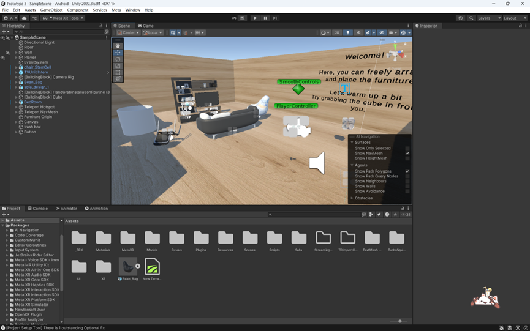

# Assessment 1.4: Final Report and Reflection

## Project: HomeCraft XR  
**Student Name:** Jialiang He

---

## 1. Objective and Validation Metrics

The goal of this evaluation was to validate the intuitiveness, comfort, and realism of gesture-based furniture manipulation (grabbing, rotating, throwing) in an immersive XR interior design environment.  
The prototype also aimed to test whether real-time collision feedback effectively improves spatial accuracy and user confidence during object placement.

### Validation Metrics

| Metric | Description | Target for Success |
|:--|:--|:--|
| **Task Completion Rate** | % of users completing all tasks without external help | ≥ 80% |
| **Mean Usability Rating** | 1–5 Likert scale average score | ≥ 4.0 |
| **Collision Error Count** | Number of overlapping placements per user | ≤ 3 |
| **Qualitative Comfort** | Interview feedback on gesture control naturalness | Majority positive responses |

**Tested assumptions:**
- Embodied gestures (grab/rotate/throw) are faster and more intuitive than menu-driven manipulation.  
- Visual + haptic collision feedback reduces placement errors and increases user confidence.

---

## 2. Results

**Participants:** 5 (3 males, 2 females), aged 21–25, with mixed XR familiarity.  
**Tasks:** Upright fallen chair, move bean bag, relocate vase, and throw object into bin.  
**Duration:** 10–15 minutes per participant.

### Quantitative Findings

| Metric | Mean | SD | Observation |
|:--|:--|:--|:--|
| **Task Completion Rate** | 100% | – | All participants completed every task |
| **Usability Score** | 4.4 / 5 | 0.5 | Generally positive |
| **Realism Score** | 4.2 / 5 | 0.4 | Users felt immersed |
| **Collision Errors** | 1.6 | 0.9 | Low frequency of overlap |
| **Average Task Time** | 4.2 min | 0.7 | Within expected range |

### Qualitative Feedback (selected quotes)

> “Grabbing felt natural, but throwing accuracy could be improved.” — **P2**  
> “The haptic vibration helped me know when objects collided — very helpful.” — **P4**  
> “Rotating larger furniture was tiring; maybe a slower gesture sensitivity would help.” — **P1**  
> “The bean bag placement was fun; it felt realistic to move around the room.” — **P5**

### Observed Behaviours

- Most users adapted quickly after a short familiarization period.  
- Two participants initially struggled to control rotation, often over-rotating before adjusting their grip.  
- Throwing gestures were occasionally misinterpreted when hand tracking was briefly lost.  
- Participants showed enjoyment when using gestures instead of menus, indicating high engagement.

---

## 3. Analysis and Insights

### 3.1 Patterns and Themes

**Natural Gesture Control but Limited Precision**  
Users found grabbing and moving gestures intuitive (“It feels like picking up real furniture”), yet precision tasks—especially rotation—were more error-prone.  
This indicates that gesture-based manipulation supports immersion but requires finer control thresholds.

**Collision Feedback Increases Confidence**  
Participants mentioned that visual flashes and vibration cues helped them “feel” object boundaries, leading to fewer incorrect placements.  
This validates the design goal of providing tangible spatial feedback.

**Immersion through Embodied Interaction**  
Compared with IP2, users’ focus shifted from novelty to realism and comfort.  
The freedom to walk, grab, and throw encouraged embodied engagement.  
The most immersive moment cited was “throwing the vase into the bin,” which merged physical and virtual responses naturally.

### 3.2 Underlying Meanings

- Users expect physical logic in XR environments — feedback and resistance signals enhance trust in the simulation.  
- Gesture calibration (speed, sensitivity) directly affects perceived usability.  
- Functional completeness (e.g., resizing, storing, duplicating furniture) becomes the next barrier after core interactions succeed.

---

## 4. Evaluation of Aims

| Evaluation Focus | Result | Evidence |
|:--|:--|:--|
| Gesture-based manipulation feels natural | **Validated** | 4.4/5 usability; 5/5 found intuitive |
| Collision feedback improves confidence | **Validated** | All users cited positive effect |
| Throwing interaction intuitive | **Partially Validated** | 2 users reported tracking inconsistency |
| Visual-haptic feedback increases accuracy | **Validated** | Low collision error count |

**Summary:**  
The testing successfully validated the key interaction assumptions. Gesture control proved effective for most users, while collision feedback provided both practical and psychological support.  
However, throw gestures and rotation precision require refinement before deployment.

---

## 5. Reflection

### 5.1 Prototype Session Review

The IP3 session demonstrated substantial progress compared to earlier prototypes.  
The interactions (grabbing, moving, throwing) functioned smoothly, with no severe usability issues.  
What worked particularly well was embodied interaction — participants instinctively reached out and manipulated objects without needing instructions.

However, gesture recognition occasionally misfired, especially for the throwing motion, reducing realism.  
This issue stemmed from limited tracking coverage in the Meta Quest headset rather than design intent.

### 5.2 Methodological Reflection

Using a **mixed-method approach** (Think-Aloud + observation + interview + Likert-scale survey) proved highly effective.  
- The Think-Aloud method revealed real-time confusion points (e.g., over-rotation).  
- Quantitative ratings provided measurable evidence, addressing the lack of metrics in prior reports.  
- Recording both task performance and subjective experience allowed triangulation of insights — a key improvement over IP1/IP2, which relied mostly on anecdotal comments.  

Future sessions could include **screen recordings** and **eye-tracking data** to enhance precision and reduce observer bias.

### 5.3 Concept Evaluation

The original HomeCraft XR concept — enabling intuitive, gesture-driven interior design — has been validated.  
Users confirmed the system’s potential for natural object manipulation and spatial planning.  
The perceived realism and satisfaction indicate the core interaction design is sound.

However, users’ feedback highlights the need for functional depth (scaling, saving layouts, importing assets).  
The concept should evolve toward a **hybrid MR platform** integrating both hand gestures and menu-based fine adjustments.

### 5.4 Improvements and Extensions

| Improvement Area | Proposed Enhancement | Possible XR Extension |
|:--|:--|:--|
| Gesture Sensitivity | Introduce adjustable thresholds or slow mode | Context-aware gesture scaling |
| Throwing Interaction | Add trajectory preview or auto-correct alignment | Combine controller + hand input for precision |
| Functional Expansion | Add “backpack” for storing items, scaling tools | Explore MR workspace allowing physical-digital sync |
| Visual Consistency | Refine lighting and material textures | Use photogrammetry or real-environment lighting adaptation |

These refinements would shift HomeCraft XR from a functional prototype to a professional-grade spatial design toolkit, improving both control precision and user experience.

---

## 6. Conclusion

The third interactive prototype successfully demonstrated that natural hand gestures and real-time feedback can provide intuitive, immersive, and efficient interior design experiences in XR.  
The evaluation confirmed that gesture-based interactions are usable and enjoyable, though they require calibration for precision tasks.

From a methodological standpoint, this evaluation represented a significant improvement in data quality, analysis depth, and reflection rigor compared to previous iterations.  
The testing validated the concept’s core assumptions and provided concrete, data-driven directions for future development.

**Learning Reflection:**  
Through structured testing and data synthesis, I learned the importance of combining numerical and behavioral insights.  
Raw numbers reveal performance trends, but only paired with user quotes can we explain *why* those numbers occur.

Future iterations should emphasize **gesture calibration** and **visual trajectory previews** to align system behavior with user expectations.  
This approach enhances both immersion and perceived control, moving HomeCraft XR closer to a professional-level interior design tool.

---

## Appendix

### Appendix A — Participant Overview

| Participant ID | Gender | XR Experience Level | Familiarity with Interior Design | Testing Duration | Notes |
|:--|:--|:--|:--|:--|:--|
| P1 | Female | Beginner | Low | 10 min | Needed initial guidance |
| P2 | Male | Intermediate | Medium | 12 min | Smooth gesture control |
| P3 | Male | Advanced | High | 15 min | Offered insightful feedback |
| P4 | Female | Beginner | Low | 11 min | Confused by throw interaction |
| P5 | Male | Intermediate | Medium | 13 min | Enjoyed environmental realism |

**General Patterns:**  
Most challenges arose from fine manipulation and throwing mechanics.  
Users responded positively to haptic and visual feedback when collisions occurred.

---

### Appendix B — Observation Notes Summary

| Task | Observed Behaviours | Errors or Confusions | Notes on Feedback |
|:--|:--|:--|:--|
| Task 1: Upright the Fallen Chair | 4 users quickly understood grab & rotate gesture | 1 user struggled with precision alignment | Gesture felt “natural” overall |
| Task 2: Move the Bean Bag | All users completed successfully | Some difficulty grabbing soft shapes | Suggested clearer object boundaries |
| Task 3: Relocate Vase | 4 users used teleport; 1 walked physically | Minor misplacement occurred | Positive feedback on spatial awareness |
| Task 4: Throw Vase into Bin | 3 users succeeded easily | 2 users found motion too sensitive | Requested “throw arc” indicator |

**General Patterns:**  
Most challenges arose from fine manipulation and throwing mechanics.  
Users responded positively to haptic and visual feedback when collisions occurred.

---

### Appendix C — Post-Task Questionnaire (Usability Survey)
*(Table omitted for brevity — Likert 1–5 usability questions.)*

---

### Appendix D — Quantitative Results Summary

| Question | Mean Score (1–5) | Interpretation |
|:--|:--|:--|
| Q1: Gesture intuitiveness | 4.6 | Strongly positive — users found gestures easy to learn |
| Q2: Motion accuracy | 4.4 | Prototype tracked hand motion effectively |
| Q3: Collision feedback | 4.8 | Feedback highly useful for object placement |
| Q4: Immersion | 4.2 | Environment well-received, minor visual bugs noted |
| Q5: Task confidence | 4.0 | Users felt comfortable during layout tasks |
| Q6: Throwing realism | 3.4 | Gesture sensitivity issues slightly reduced satisfaction |
| Q7: Overall satisfaction | 4.6 | Strong approval of concept and usability |

---

**Prototype Screenshot (omitted)**  

