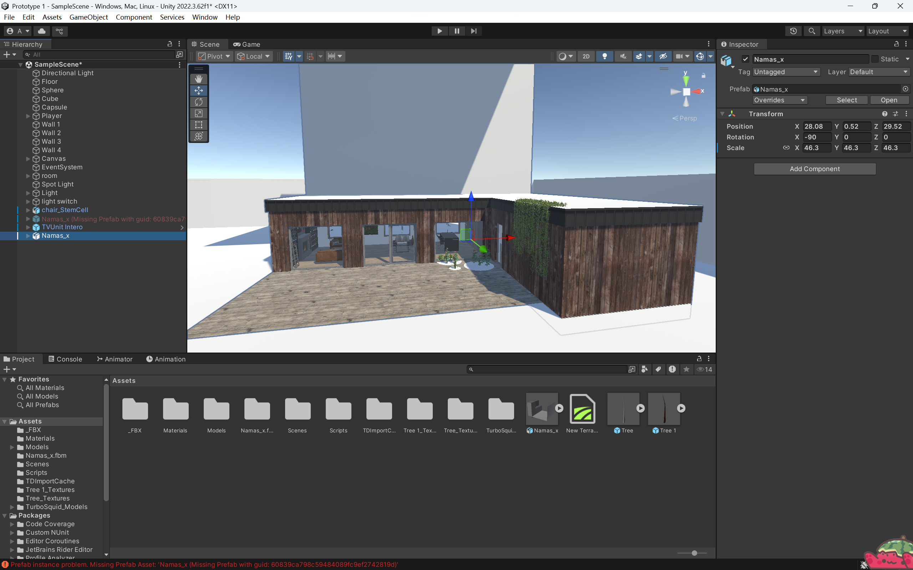
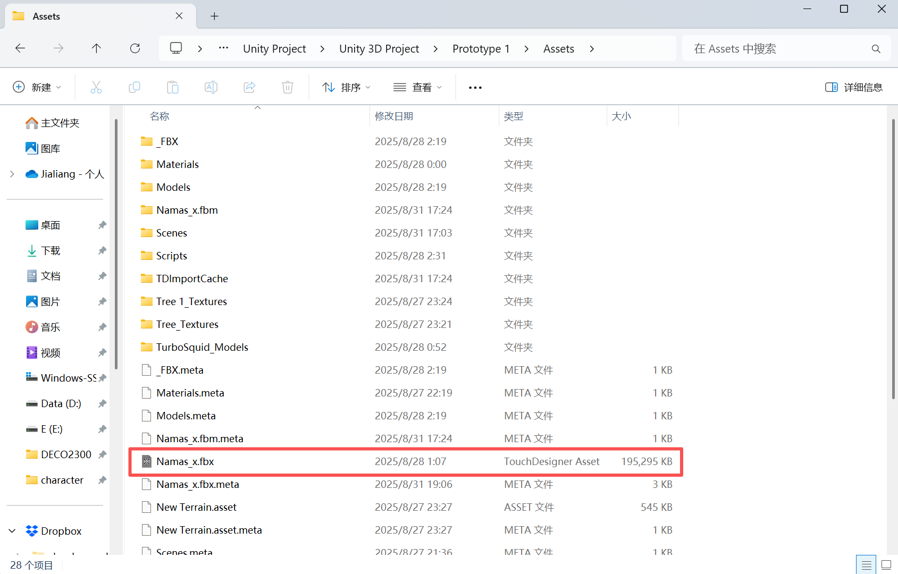

# Project Assets Overview

## FBX Model

This project contains a **FBX file** named `Namas_x.fbx` located in the **Assets** folder.  

> ⚠️ **Important:** This file is approximately **190MB**, which exceeds GitHub's single file upload limit of 100MB.  
> Therefore, the FBX file is **not uploaded to this repository**.  

**Description:**  
- `Namas_x.fbx` is a **house model** used in the Unity project.  
- The model includes furniture, walls, and basic interior layouts suitable for XR or game prototyping.

---

## Preview Images

Below are preview screenshots from the Unity project:

### Model in Unity Scene
  

### Assets Folder Structure
  

---
## References

The Unity project also uses assets sourced externally:

- TV Stand model: [TurboSquid - TV Stand C4D Free](https://www.turbosquid.com/3d-models/tv-stand-c4d-free/1103887)  
- House model: [TurboSquid - 3D House](https://www.turbosquid.com/3d-models/3d-house-1628048)  

These assets were imported into Unity and are referenced in the project.  

---

## Notes

- To use the `Namas_x.fbx` model, please obtain the file “House model” (Link in Ref) due to its large size.  
- All other project scripts and resources are included in this repository and can be used without the FBX file.  

